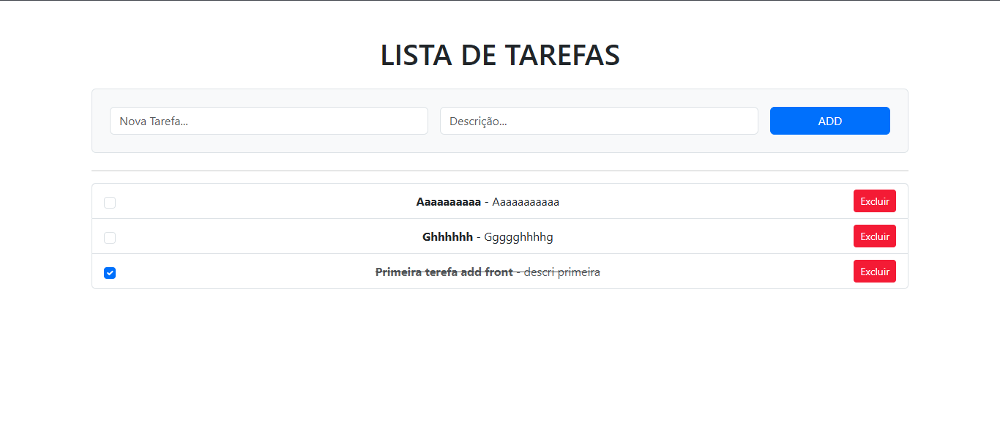

# Projeto Lista de Tarefas (To-Do List)



## 📖 Descrição

Este é um projeto full-stack de uma aplicação de Lista de Tarefas (To-Do List), desenvolvido como parte de um estudo prático para adquirir competências de um programador backend júnior. A aplicação permite aos utilizadores gerir as suas tarefas através de uma interface web simples e também expõe uma API RESTful completa para manipulação dos dados.

O projeto foi construído utilizando uma arquitetura em camadas (Controller, Service, Repository) para garantir a organização, manutenibilidade e escalabilidade do código.

---

## 🚀 Tecnologias Utilizadas

Este projeto demonstra competência nas seguintes tecnologias:

**Backend:**

- **Java 17**
- **Spring Boot:** Framework principal para a construção da aplicação.
- **Spring Web:** Para a criação dos controllers web e da API REST.
- **Spring Data JPA / Hibernate:** Para a persistência de dados e mapeamento objeto-relacional.
- **Spring Boot Validation:** Para a validação dos dados de entrada.

**Frontend:**

- **Thymeleaf:** Para a renderização de páginas no lado do servidor (interface inicial).
- **HTML5 / CSS3**
- **JavaScript (ES6+):** Para a construção de um cliente que consome a API REST, criando uma experiência de página única (SPA).
- **Bootstrap 5:** Para a estilização rápida e responsiva da interface.

**Base de Dados:**

- **H2 Database:** Base de dados em memória para um ambiente de desenvolvimento e teste simplificado.

**Build & Gestão de Dependências:**

- **Apache Maven**

---

## ✨ Funcionalidades

- **Gestão de Tarefas (Interface Web):**
  - Listar todas as tarefas.
  - Adicionar novas tarefas com validação de entrada.
  - Marcar tarefas como concluídas/pendentes.
  - Excluir tarefas.
- **API RESTful Completa:**
  - Endpoints para todas as operações CRUD (Create, Read, Update, Delete) sobre as tarefas.
- **Cliente de API Dinâmico:**
  - Uma segunda interface (SPA) construída com JavaScript puro que consome a API REST.
  - Atualizações da interface em tempo real sem necessidade de recarregar a página.

---

## Endpoints da API

A API REST está disponível sob o caminho base `/api/tarefas`.

| Verbo    | Endpoint            | Descrição                              |
| -------- | ------------------- | -------------------------------------- |
| `GET`    | `/api/tarefas`      | Retorna uma lista de todas as tarefas. |
| `GET`    | `/api/tarefas/{id}` | Retorna uma única tarefa pelo seu ID.  |
| `POST`   | `/api/tarefas`      | Cria uma nova tarefa.                  |
| `PUT`    | `/api/tarefas/{id}` | Atualiza uma tarefa existente.         |
| `DELETE` | `/api/tarefas/{id}` | Exclui uma tarefa pelo seu ID.         |

---

## ⚙️ Como Executar o Projeto Localmente

**Pré-requisitos:**

- Java JDK 17 ou superior.
- Apache Maven.

**Passos:**

1.  **Clone o repositório:**

    ```bash
    git clone <url-do-seu-repositorio>
    cd demo
    ```

2.  **Execute a aplicação com o Maven:**

    ```bash
    mvn spring-boot:run
    ```

    A aplicação estará a ser executada em `http://localhost:8080`.

3.  **Aceda às interfaces:**
    - **Interface renderizada no servidor (Thymeleaf):**
      [http://localhost:8080/](http://localhost:8080/)
    - **Interface SPA (Cliente da API com JavaScript):**
      [http://localhost:8080/api-client.html](http://localhost:8080/api-client.html)
    - **Consola da Base de Dados H2:**
      [http://localhost:8080/h2-console](http://localhost:8080/h2-console) (Use as credenciais do ficheiro `application.properties`).

---

## 👨‍💻 Autor

Ebert-g
